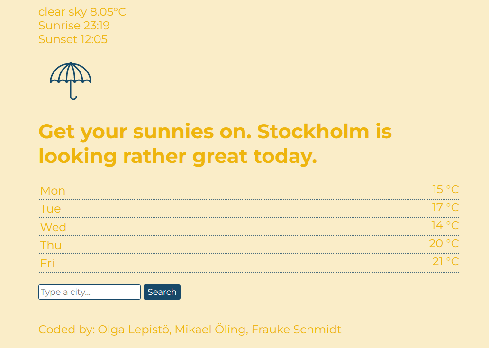

# Project Name
Technigo-project5-project-weather-app

# Technigo web development bootcamp august 2023 - jan 2024: project 2

*This week's project is to build a simple weather dashboard that tells today's weather and temperature and a 5-day forecast using a weather API.* 

This project should be done in pairs. You will practice how to work in a dev team, and make sure that both of you [checks this resource out](https://www.notion.so/Working-in-teams-on-GitHub-46b2f4e4a01847a8bf575f9904739088?pvs=21). 

**What you need to do**
✓ You should fetch data from the API using `fetch()` in JavaScript

✓ All data in the sketch above should be present and fetched from the API

✓ The presentation of the data should be in the specified format.

✓ The page should work on mobile (mobile first!), tablet and desktop (Be responsive)

✓ Follow the [instructions](https://github.com/Technigo/project-weather-app/blob/master/instructions.md). Steps 1 & 2 should be done together and step 3 should be done in branches

## Table of contents

  - [Overview](#overview)
  - [Screenshot](#screenshot)
  - [Links](#links)
  - [My process](#my-process)
  - [Built with](#built-with)
  - [What I learned](#what-i-learned)
  - [Continued development](#continued-development)
  - [Useful resources](#useful-resources)
  - [Author](#author)

## Overview

5th challenge for front end developer students.

### Screenshot

.

### Links

- Solution URL: [https://github.com/mikaeloling/project-weather-app]
- Live Site URL: [https://peppy-squirrel-8d0497.netlify.app/]

## Our process

- making a styling draft in figma
- coding basic html together
- discussing necessary features and distributing amongst team
- creating feature branches
- coding feature, merging branches, if necessary solve conflicts
- consulting personal notes regarding usage of comandos, asking team mates and other resources

### Built with

- Semantic HTML5 markup
- vanilla JS
- CSS custom properties
- editor: visual studio code

### What I learned 

How to manipulate the DOM with vanilla JS, connecting to APIs and retrieving desired data, reacting on different values, how ta access and process data in objects and arrays, formatting unix timestamps, how to conduct the flow of executions, team work in branches.

### Continued development

Better understanding of APIs, working with unix time formats.

### Useful resources

stackoverflow, W3schools, youtube videos.

## Authors
Olga Lepistö

Mikael Öling

Frauke Schmidt:
- Linkedin - (https://www.linkedin.com/in/frauke-s-395242201/)
- Github - (https://github.com/colognia/)
