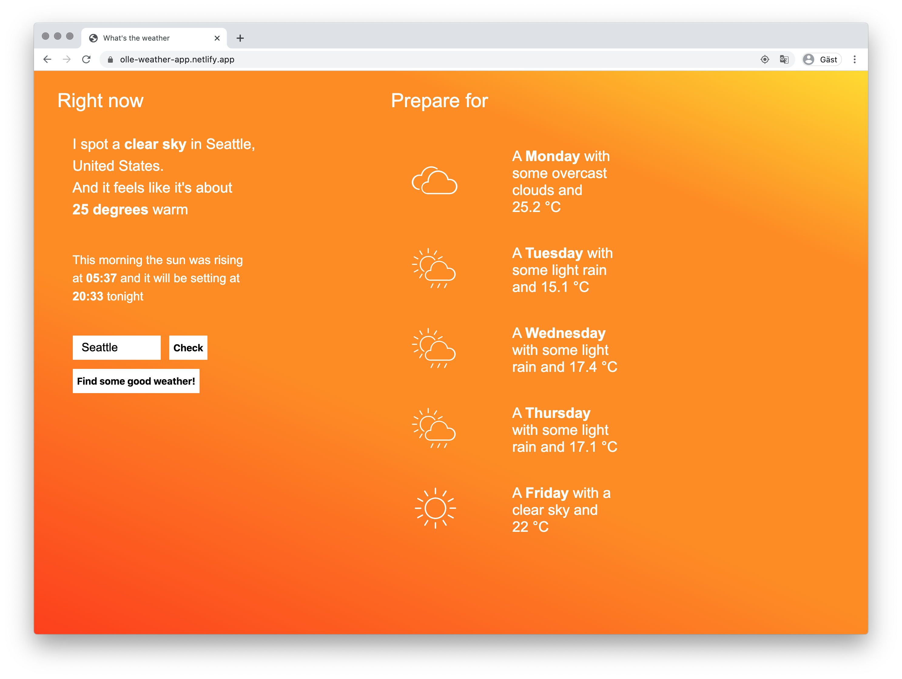

# Good Weather&ensp;|&ensp;[View Live &#10555;](https://olle-weather-app.netlify.app/)

Weather Web App built with ”Vanilla” JavaScript using OpenWeather API.

### Geolocation, search and conditional rendering
It shows today's weather and temperature, a 5-day forecast and time of sunsets and sunrise. It uses the browsers Geolocation to detect what city to check, and there’s also a simple search function. The color of the sites conditionally renders based on the weather. 

### Date object and time conversion
The sunrise and sunset is converted from unix timestamp, and then offset with the time difference to show the local times for each location. The 5 day forecast also converts the time to return each days weather as close to 12 am local time as possible, based on the 3 hour forecasts from the API.

### Find some good weather
As a bonus future I added a function to find a random location with good weather. It fetches a random city, and if the weather is good based on a set of conditions it returns the weather. Due to the limitation of the free API, it returns false after 20 failed attempts and asks the user to try again.  

## Core Tech
* Fetch API
* Promises
* Geolocation
* Date() 
* Unix time conversion
* JavaScript ES6

## Screenshot

## View it live
https://olle-weather-app.netlify.app
